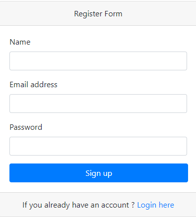
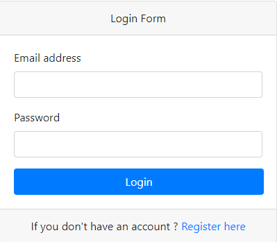
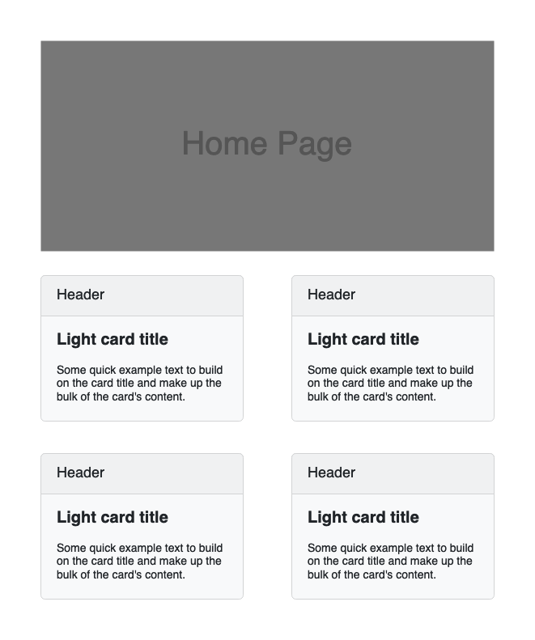

# Membership Project
The complete process of creating a user registration system where users can create an account by providing username, email and password, login and logout using PHP and MySQL.It also show how to make home page accessible only to logged-in users. Any other user not logged in will not be able to access the page.

## Requirements

- PHP 8
- Apache 
- MySQL 8

## Installation

Clone the repository
```
git clone https://github.com/KyiMyatNoeSoe7/php-register.git
```

Import database from command prompt

- Create database 
- Open Command Prompt
- Type this [Syntax](#syntax)

Syntax-

```
mysql -u username -p database_name < file.sql
```

>**username** = *Your MySQL username.*<br /><br />
**database_name** = *Database name in which you want to import.*<br /><br />
**file.sql** = *SQL file name.*

# Features

- [Register](#register)
- [Login](#login)
- [Home](#home)
- [Logout](#logout)
## Register
Here is a register page. Must be fill all input field `name`,`email`, and `password`. Show error message if something is missing. After register, this result is saved to `users` table of database and redirect to home page.
    


## login

Here is a login page.When email and password is equal to the results from `users` table, redirect to home page. It should not access after logged in. Show error message if email or password is incorrect. 




## Home

Here is home page. It can be access after logged in. It should not access without logged in.



## Logout

Logout and redirect to login page.
